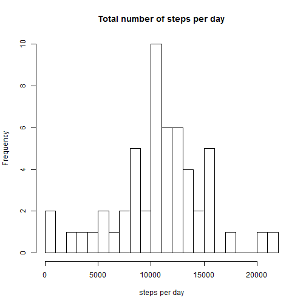
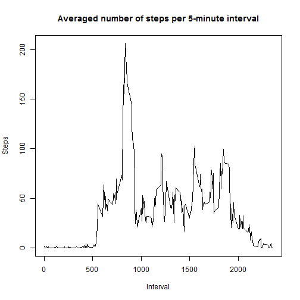
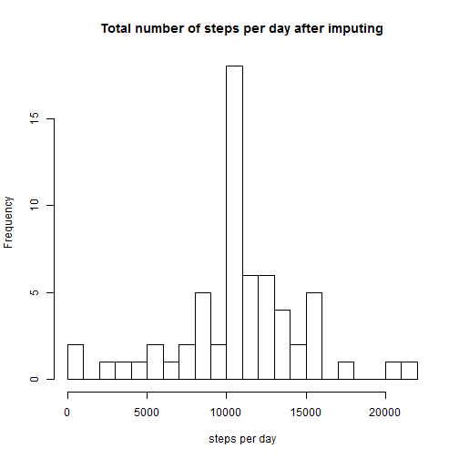
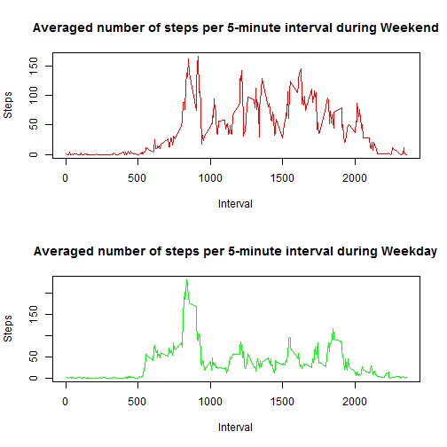
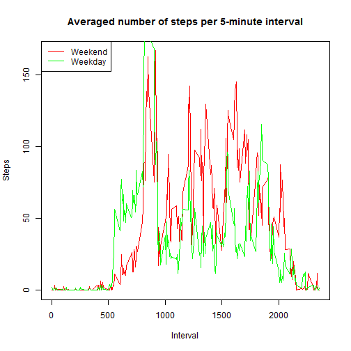

## Loading and preprocessing the data

It is assumes you have the unzipped activity.csv file in your working directory. Load this file into R enviroment and preprocess it as

```r
data <- read.csv('activity.csv', header = TRUE, colClasses=c("numeric", "character", "numeric"))
data$date <- as.Date(data$date, format = "%Y-%m-%d")
```

## What is mean total number of steps taken per day?

For this part of the assignment, the missing values in the dataset are ignored.

Total number of steps taken per each data are estimated as

```r
StepsDay <- aggregate(steps ~ date, data, sum)
colnames(StepsDay) <- c("date","steps")
```

Distribution of total number of steps per day could be visualized as a histogram

```r
hist(StepsDay$steps, breaks = 20, xlab = 'steps per day', main = 'Total number of steps per day')
```

 

Mean value of steps per day is

```r
mean(StepsDay$steps)
```

```
## [1] 10766.19
```

Median of steps per day is

```r
median(StepsDay$steps)
```

```
## [1] 10765
```

## What is the average daily activity pattern?

Draw time series plot of the 5-minute interval (x-axis) and the average number of steps taken, averaged across all days (y-axis)


```r
StepsInterval <- aggregate(steps ~ interval, data, mean)
colnames(StepsInterval) <- c("interval","steps")
StepsInterval$interval <- as.numeric(as.character(StepsInterval$interval))
# sort AtepInterval in ascending order of intervals
ind <- order(StepsInterval$interval)
StepsInterval <- StepsInterval[ind,]
plot(StepsInterval$interval, StepsInterval$steps, type = "l", main = "Averaged number of steps per 5-minute interval", ylab = "Steps", xlab = "Interval")
```

 

Estimate which 5-minute interval, on average across all the days in the dataset, contains the maximum number of steps


```r
StepsInterval[which.max(StepsInterval$steps),1]
```

```
## [1] 835
```

## Imputing missing values

Total number of missing values in the dataset is


```r
sum(is.na(data$steps))
```

```
## [1] 2304
```

In place of any missing value an averaged number (across all available data) of steps for correspondent interval is imputed and results are stored in new dataset *data1*


```r
data1 <- data
Indices <- which(is.na(data1$steps))
for (i in Indices){
    data1$steps[i] <- StepsInterval[StepsInterval$interval == data1$interval[i],2]
}
```

Total number of steps taken per each data after imputing missing values are estimated as

```r
StepsDay1 <- aggregate(steps ~ date, data1, sum)
colnames(StepsDay1) <- c("date","steps")
```

Distribution of total number of steps per day could be visualized as a histogram

```r
hist(StepsDay1$steps, breaks = 20, xlab = 'steps per day', main = 'Total number of steps per day after imputing')
```

 

Mean value of steps per day after imputing missing values is

```r
mean(StepsDay1$steps)
```

```
## [1] 10766.19
```

Median of steps per day after imputing mising values is

```r
median(StepsDay1$steps)
```

```
## [1] 10766.19
```

The way, how missing values were imputted, does not change mean values, but change median a little bit (right now median is equal to mean). As such, our way of imputing introduces only marginal changes to median and does not change the mean.

## Are there differences in activity patterns between weekdays and weekends?

Create a new factor variable *weekend* in the dataset *data1* with two levels - "weekday" and "weekend" indicating whether a given date is a weekday or weekend day


```r
days <- weekdays(data1$date)
data1$weekend <- 'weekday'
data1$weekend[days %in% c('Saturday', 'Sunday')] <- 'weekend'
data1$weekend <- as.factor(data1$weekend)
```

Estimate time series of the average number of steps taken during each *interval*, where average is taken across all weekend days

```r
StepsIntervalWeekend <- aggregate(steps ~ interval, data1[data1$weekend == 'weekend',], mean)
colnames(StepsIntervalWeekend) <- c("interval","steps")
StepsIntervalWeekend$interval <- as.numeric(as.character(StepsIntervalWeekend$interval))
# sort AtepInterval in ascending order of intervals
ind <- order(StepsIntervalWeekend$interval)
StepsIntervalWeekend <- StepsIntervalWeekend[ind,]
```

Estimate time series of the average number of steps taken during each *interval*, where average is taken across all weekdays

```r
StepsIntervalWeekday <- aggregate(steps ~ interval, data1[data1$weekend == 'weekday',], mean)
colnames(StepsIntervalWeekday) <- c("interval","steps")
StepsIntervalWeekday$interval <- as.numeric(as.character(StepsIntervalWeekday$interval))
# sort AtepInterval in ascending order of intervals
ind <- order(StepsIntervalWeekday$interval)
StepsIntervalWeekday <- StepsIntervalWeekday[ind,]
```

Plot averaged weekend and weekday profiles of avraged number of steps taken during each *interval*:

 - on 2 different pannels (as it is requested in the assignment)

```r
par(mfrow = c(2,1))
plot(StepsIntervalWeekend$interval, StepsIntervalWeekend$steps, type = "l", main = "Averaged number of steps per 5-minute interval during Weekend", ylab = "Steps", xlab = "Interval", col = "red")
plot(StepsIntervalWeekday$interval, StepsIntervalWeekday$steps, type = "l", main = "Averaged number of steps per 5-minute interval during Weekday", ylab = "Steps", xlab = "Interval", col="green")
```

 
 
 - in the same coordinate windows, where it is easy to make comparison

```r
par(mfrow = c(1,1))
plot(StepsIntervalWeekend$interval, StepsIntervalWeekend$steps, type = "l", main = "Averaged number of steps per 5-minute interval", ylab = "Steps", xlab = "Interval", col = "red")
lines(StepsIntervalWeekday$interval, StepsIntervalWeekday$steps, col="green")
legend("topleft", c("Weekend", "Weekday"), lty = c(1, 1), lwd = c(1, 1), col = c("red", "green"))
```

 
